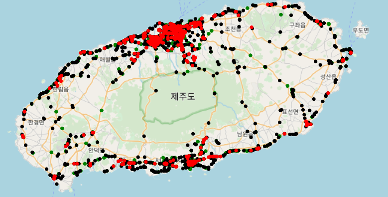
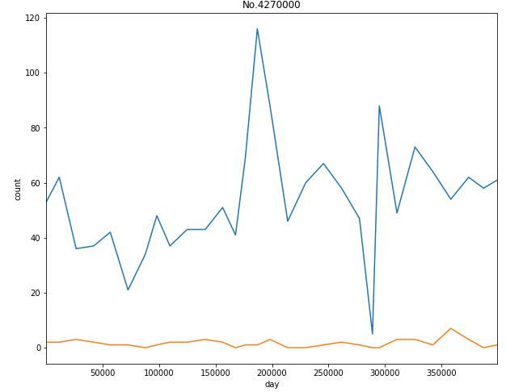
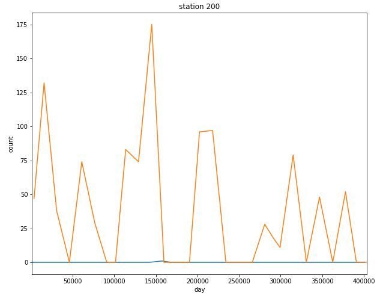
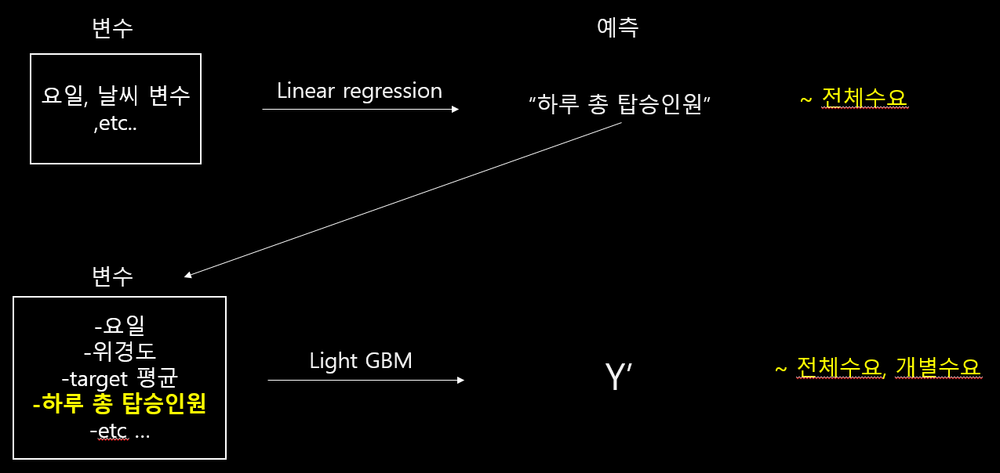

# 버스 수요 예측

**개요** : 데이콘에서 진행된 공모전으로, 제주시 내 버스의 승객 승하차 데이터를 토대로 미래의 퇴근시간(18~20)의 버스 탑승  승객의 수를 예측하는 문제.  2019년 09-01 ~ 09-30 일까지의 30일 동안의 데이터로 미래의 2019년 10-01~10-15일까지의 값을 예측해야한다.

**내용**:  

> "제주도내 주민등록인구는 2019년 11월 기준 69만명으로, 연평균 4%대로 성장했습니다.외국인과 관광객까지 고려하면 전체 상주인구는 90만명을 넘을 것으로 추정됩니다. 제주도민 증가와 외국인의 증가로 현재 제주도의 교통체증이 심각한 문제로 떠오르고 있습니다. 2017년 한국은행 제주본부에 따르면 제주도 일부 지역은 교통체증이 서울보다 심각합니다.따라서, 제주테크노파크는 교통난 심화를 해결하기 위해 데이터 분석 대회를 개최합니다"

**데이터 설명**:  데이터는 고유번호, 버스노선,정류장번호,위경도,시간대별승하차인원수 그리고 `target인 퇴근시간대 18~20시 승차인원` 으롤 구성되어 있다.

**목표**: 특정 노선,특정 정류장의 날짜마다의 target 승차인원을 맞추는 것이다. 10월 1일부터 15일동안의 값을 예측하는 문제. 노선마다 서로 다른 정류장의 예측값을 15일동안 맞추는 문제.

## 데이터 탐색 & 생각.

목표는 target을 잘 맞추는것이다. 잊지말자.

제주도는 잘 알려진 관광도시로 버스의 성격도 다양하다. 알아본 바로는 간선,지선,내선순환,공항버스,야간버스,관광지순환,외곽순환 등 다양한 특징들이 가지고 있었다. 

위의 이미지는 제주도의 지도에 정류장의 위경도를 대입해 만든 정류장 맵이다.(전체정류장 중 일부). 예를들면 빨간색 노선은 제주시, 서귀포시 등 중심지 를 위주로 운행되는 노선인 반면 검은점의 경우 섬의 외곽을 연결하는 특징을 가지고 있다. 

## point.1 개성

위에서 기술했듯이 노선은 노선마다의 특징이 있다. 승차인원이 많은 인기노선이 있고 그렇지 않은 노선도 있는것이다.  같은 노선이라도 정류장별로 승차인원의 차이가 발생하기도 한다.  같은 정류장이라도 노선별로 승차인원의 양상이 다를 수 있다. **종합하면 관심있게 분석해야할 부분은 어떤 노선의 특정 정류장을 개성을 주체로 그 개성을 잘 찾는 것이이다.**

아래는 특정 노선의 서로다른 두정류장을 비교한것이다. 

보는 것과 같이 같은 노선이지만 정류장별로 target 값의 차이가 현저하다.

반대로 같은 정류장에서 서로다른 노선을 비교해보면

마찬가지로 같은 정류장임에도 불구하고 target 값이 노선별로 현저히 다르다. 

노선 내 특정 정류장마다 승차인원이 다 다르다. 이를 `'개성'` 이라고 부르겠다. 이 개성을 어떻게 알아낼 수 있을까? 개성(target 승차인원의 수)은 어떻게 결정될까?  

몇가지 추론을 해보면

1. target은 18~20시의 승차인원이다. 보통 퇴근/하교 시간이다. 회사가 밀집되어있거나 학교가 있는 곳의 정류장이 target값이 높을 수 있다.
2. 정류장이 같더라도 노선마다 승차인원이 차이날 수 있다. 퇴근/하교 후 집으로 보통 간다고 가정을 하면 인구가 밀집되어 있는 지역을 지나는 노선이 인기가 많을 수 있다.

## point.2 전체수요

앞서 '개성'의 측면을 고려했다면 이번에는 전체수요 에 대해서 고려해야한다. '개성' 이라는 개별 노선/정류장의 탑승객 수는 버스 탑승객 전체 수에 아주 밀접한 연관을 가지고 있다. 

이를 테면 날씨, 그중에서 강우량은 버스탑승에 영향을 끼친다고 알려져 있다. 제주도의 경우 강우와 태풍의 영향이 잦은 지역이고 주어진 기간 사이에도 두번의 태풍영향을 받았다.  비오거나 태풍오는 날은 전반적 버스 수요가 줄어든다. 

요일도 좋은 요인일 수 있다. 평일과 주말/공휴일은 버스 전체수요를 결정하는데 영향을 주는 요인 중 하나이다.

## 변수 다루기

가지고 있는 변수들을 토대로 여러 변수들을 만들어 보았다. 예를들면

* 특정 위치와의 거리(제주시,서귀포시,공항) :
* 노선의 평균 위경도
* 노선내 정류장의 거리 분산
* 해당 정류장 반경 1km내 다른 정류장 개수
* ......

**1. target encoding**

만들어진 변수들을 추가하면 조금씩의 예측성능의 향상을 확인할 수 있었다. 하지만 자료를 분석하면서 가장 큰 성능향상을 가져다 주었던 변수는 **'target encoding'**된 변수들이었다.

**'target encoding'** 은 우리가 예측해야하는 label 또는 값을 이용하여 예측을 위한 변수로 사용하는 것을 말한다. 분류문제에서는 각 클래스의 비율을 변수로 다시 하는 것을 종종 볼 수 있다.

지금의 문제에서는 노선 내 특정 정류장의 평균 target 값과 분산을 새로운 변수로 만들 수 있었다. 그러면 유니크한 정류장의 개별 특징들이 잘 반영되는 아주 정보량이 높은 변수가 만들어 지게 된다. 다른 추가변수들 없이 이 변수들만 예측에 사용해도 아주 높은 성능을 확인할 수 있었다. 

이 변수는 앞서 이야기했던 '개성'을 잘 반영하는 변수이다.

**2. 날씨, 요일/공휴일**

전체 수요에 영향을 끼치는 요인들을 고려할 떄 사용했던 변수로는 날씨와 요일이 있다.비가 많이 오거나 태풍이 부는날 또는 주말의 경우는 탑승객 수가 줄어드는 경향성을 발견할 수 있었다. 기상청 데이터를 크롤링 하여 새로운 변수로 추가 하였다.

## 모델

모델은 총 2가지로 구성된다. 

* 모델1 : 주어진 데이터를 바탕으로 전체 수요를 예측하는 모델
* 모델2 : target 을 예측하는 모델.  

모델1 의 경우 기존 데이터를 변형하여 하루단위 데이터로 만든뒤 선형 회귀 모델을 통해 전체수요를 추정하였다. 그후 추정한 값들을 모델2 의 추가변수로 사용하여 'Light GBM' 모델을 통해 최종결과를 추론하였다.

