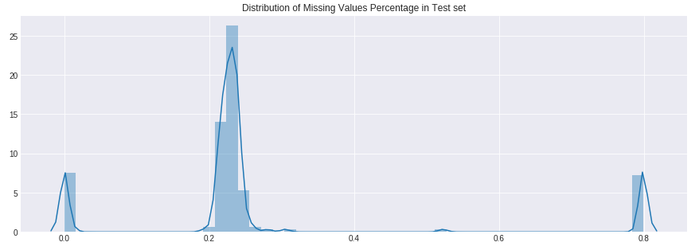
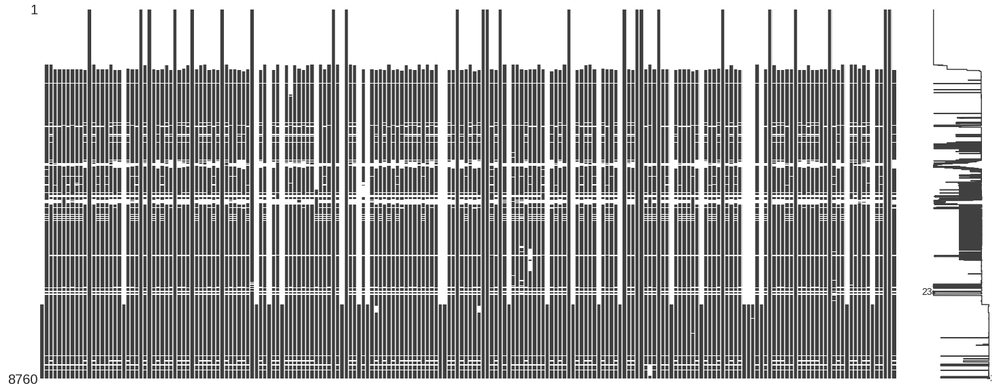
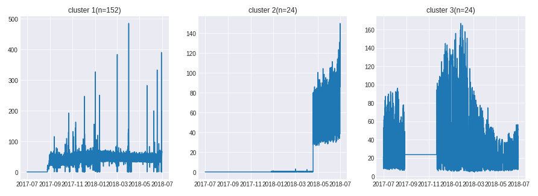
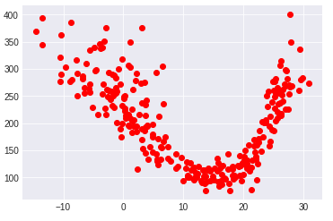
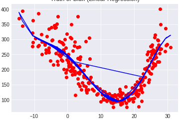
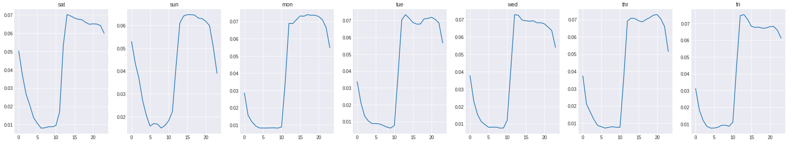
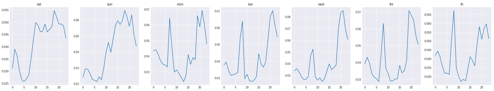
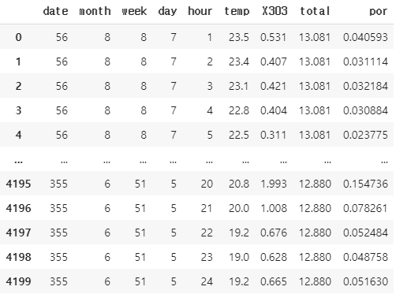
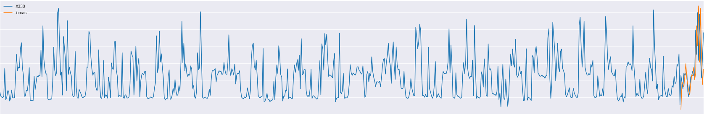

# 전력 수요 예측

개요 : 데이콘에서 열린 공모전으로, 200개 세대의 '2017-07-01 00:00:00' ~ '2018-06-30 23:00:00' 1년동안 한시간 간격으로 전력사용량을 측정한 데이터를 바탕으로 미래의 전력사용량을 예측하는 목적.


목표 : 미래의 전력수요 예측(총 39개)

* '2018-07-01'의 시간당 전력사용량 24개
* '2018-07-01'~'2018-07-10'의 일별 전력사용량 10개
* '2018-07'~ '2018-11' 월별 사용량 5개.


## EDA

raw 데이터를 살펴보면 우선 알 수 있는 점은 결측치가 상당히 많다는 점이다.




온전히 모든 데이터를 다가지고 있는 경우가 드물다. 그리고 결측비율을 기준으로 3가지의 군집을 가시적으로 확인할 수 있다.


다시한번 보자

```python
import missingno as msno
msno.matrix(test)
```



결측되는것이 무작위가 아니라 특정한 패턴이 있고 그 패턴에 따라 '가구'들의 군집을 나눌 수 있다. 이 지점에서의 생각은 1)개인의 문제가 아니라 구조적인 이유로 결측이 되었다.결측이 군집마다 서로 다르게 나타났다. 지리적인 유사성일 수도 있고 사용자의 특징에 다른 유사성일 수도 있다.


결측치의 특징

* 단발적
* 구조적


결측치를 어떻게 다루는 지가 중요한 문제라 생각됨.


### 클러스터링

결측되는 패턴과 k-means의 elbo method를 이용하여 k=3으로한 군집으로 나누어 보면.

* cluster1: 152
* cluster2: 24
* cluster3: 24

로 나눌수 있다.


군집간의 특성을 알고싶다. 군집내 가구들의 전력사용량을 모두 합해서 그래프로 보면

```python
fig,ax = plt.subplots(1,3, figsize=(15,5))
ax[0].plot(test[cl1].sum(axis=1))
ax[0].set_title('cluster 1(n={})'.format(len(cl1)))

ax[1].plot(test[cl2].sum(axis=1))
ax[1].set_title('cluster 2(n={})'.format(len(cl2)))

ax[2].plot(test[cl3].sum(axis=1))
ax[2].set_title('cluster 3(n={})'.format(len(cl3)))

plt.show()
```



* cluster1 : 152개의 가구에도 불구하고 전력사용량이 높지 않다. 대체적으로 100 미만의 값이고 간혹 이상치 같은 높은 값들이 존재한다. 사용량의 크기로 보아 일반 가구라 예측. 계절성이 뚜렷하지 않음.
* cluster2: 가구수는 24개로 적지만 사용량이 크다. 아마 가게/회사/공장 등 목적이 있는 가구라 추측. 데이터의 80%가 결측치로 존재한다. 여름이 되어 사용량이 증가하는 추세를 보여준다
* cluster3: 가구 사용량이 크다. cluster2와 마찬가지로 일반 가구는 아니고 목적가구라 추측.데이터 내 일부 오측정된 부분이 있음. 계절에 따른 사용량의 변화가 보임.


## 결측치 & 이상치 처리.

성격에 따라.

* 개인적 : 개별 가구의 특징으로 발생.
* 구조적 : 가구가 아니라 집단으로 발생.


양상에 따라.

* 단발적 : 단발적으로 결측치가 있는경우
* 장기적 : 결측치가 장기간 지속되는경우(얼마나 장기간인지 정해야함 임의로)


### 장기적 결측치 처리

사전 정보로 온도에 민감하게 반응 한다는점을 알았다. 더우면 냉방, 추우면 난방의 이유로.

계절성에 민감한 cluster3의 데이터 샘플을 한번보자. 



x축은 하루 평균온도, y축은 하루총 전기사용량이다. 온도가 더워지거나 추워지면 전기사용량이 많아짐을 알 수가있다. 이를 토대로 계절성을 가질것이라 예상하는 cluster3의 장기적인 결측치를 채워보려고한다.개별가구마다 차이가 있을 수 있지만 클러스터의 지배적인 특징은 계절성을 가지는 것이고 이는 온도에 민감하기에. cluster2은 결츠칙가 너무 많기에 채우지 않는다. 




단순 선형회귀로 온도를 통해 전기 사용량을 추정하면 올바른 추정이 될 수 없다. 다음과같은 곡선의 형태이기 때문에. 따라서 polynomial regression을 이용하여 비선형 회귀추론 한다. 

주의 할점은 언급했듯이 기존의 한시간 단위의 전기사용량에서 하루단위로 바꾸었다는 점.


### seasonality

시간에 따른 계절성은 3가지로 나누어 보았다.

* 하루 시간 별 변화
* 요일 별 변화
* 계절 별 변화


하루 24시간 내에서의 cycle의 경우는 대부분의 가구에서 각 가구의 특징이 반영된 형태로 나타내 주고 있었다. 다만 요일 별 변화 또는 계절 별 변화는 특징을 가지는 가구도있고 그렇지 않은 가구도 있었다. 예를들면 

 



상기 그래프는 하루 총 전기사용량에서 각 시간대가 차지하는 비율로 나타낸 그래프이다. 따라서 모든 영역을 더하면 합이 1이 되는 시간대별 비율이다. 첫번째 행 그래프의 경우 cluster2에서 샘플링한 가구의 데이터이고 두번째 행의 그래프들은 cluster1에서 샘플링한 가구의 데이터이다. cluster2, cluster3의 데이터들은 대개 시간대별로 요일간 무차별적인 일정한 비율로 보여준 반면 cluster1의 데이터의 경우는 요일별로 특히 평일고 주말의 편차를 가지는 것처럼 보여준다.


따라서,

장기적인 결측치의 경우, 

* cluster.1: **시간별 변화**, **요일별 변화** 

  -> 해당 가구의 나머지 데이터 해당요일의 평균 하루 사용량 + 해당 요일의 시간대별 전기사용 비율로 추정 . 

* cluster.2: **시간별 변화**, **계절별 변화** 

  -> 장기적 결측치가 80%나 되어 imputation 하지 않는다.

* cluster.3: **시간별 변화**, **계절별 변화** ->

  -> 하루평균 기온을 이용하여 하루 총 사용량 regression 후, 해당 요일의  시간대별 전기사용 비율로 추정


ex) 온도를 이용해서 특정 요일의 하루 총 사용량을 구한다. 100이라고 하자. 그 후 해당 요일의 시간대별 비율로 나눈다. 1~2시 사이의 전기사용비율이 10프로라고 하면 해당 시간대 사용량은 100x0.1 =10.


단발적으로, ''값 결측 값'' 인경우는 단순 선형 interpolation 으로 보간.


정리!

''값 결측 값'' 인경우는 단순 선형 interpolation 으로 보간. 결측이 3개 이하인경우 까지만 사용

결측이 4개 부터 ~ 21일 이하로는 결측 구간 기준 -2주 ~ +2주 의 평균 값으로 대체


**ex) 재구성된 테이블** 




## 모델


페이스북에서 공개한 시계열 예측 라이브러리 'Prophet' 을 이용하여 추정. cluster별로 따로 진행.


